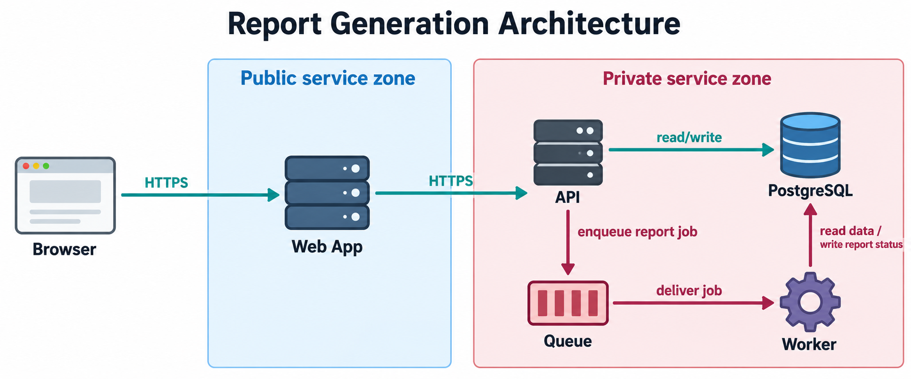

# VizSwitch: Architecture-to-Image v1.1

**Turn a system description into a structured, image-generator-ready prompt while preserving its components, boundaries, and flows.** A personal project by B Hui.

**[Try VizSwitch in ChatGPT](https://chatgpt.com/plugins/plugin_d31d6cf050048191bc359b447e83a3f0?open_in_app)** (live plugin; requires a ChatGPT account and access to plugins).

The prompt is the product. VizSwitch clarifies the message and audience, recommends styles, and specifies layout, labels, relationships, and constraints. An image-capable tool renders the result after confirmation. Its primary scope is architecture visualization; style family 6 also supports narrative and educational communication.

## End-to-end architecture example

This report-generation system demonstrates **input -> structured prompt -> generated image**. It was prepared for this repository using the published v1.1 workflow and rendered with Codex's built-in image tool. It is a new worked example, not a transcript of a live ChatGPT plugin session or a production deployment.

### 1. Sample input

> Visualize a report-generation web application for an engineering onboarding guide. Browser is outside the service boundaries. Web App is in the public service zone. API, PostgreSQL, Queue, and Worker are in the private service zone. Preserve these six directed relationships: Browser -> Web App (HTTPS); Web App -> API (HTTPS); API -> PostgreSQL (read/write); API -> Queue (enqueue report job); Queue -> Worker (deliver job); Worker -> PostgreSQL (read data / write report status). Do not add a cloud provider, authentication service, or extra components. Choose the clearest style for me.

### 2. Structured prompt

Selected family: **Deployment & Trust Architecture**. Concept: **Request path and background jobs**. This complete generator input is also saved in [architecture-prompt.txt](examples/report-generation/architecture-prompt.txt).

```text
Use case: infographic-diagram
Asset type: architecture illustration for a GitHub worked example
Primary request: Create a clear landscape architecture diagram titled
"Report Generation Architecture" for engineering onboarding.

Layout & composition: Read left to right. Browser sits outside all service
boundaries at left. A labeled Public service zone contains Web App in the
middle. A labeled Private service zone occupies the right and contains API,
PostgreSQL, Queue, and Worker. Place API toward the upper left of that zone,
PostgreSQL upper right, Queue lower left, and Worker lower right. Use ample
space for labels and route connections without passing through nodes.

Components and grouping: Exactly six nodes named Browser, Web App, API,
PostgreSQL, Queue, and Worker. Public service zone contains only Web App.
Private service zone contains only API, PostgreSQL, Queue, and Worker.
Browser is outside both boundaries. Use simple recognizable component icons.

Flows/relationships: Exactly six single-headed arrows:
1. Browser -> Web App, labeled "HTTPS".
2. Web App -> API, labeled "HTTPS".
3. API -> PostgreSQL, labeled "read/write".
4. API -> Queue, labeled "enqueue report job".
5. Queue -> Worker, labeled "deliver job".
6. Worker -> PostgreSQL, labeled "read data / write report status".
The last arrow points upward from Worker to PostgreSQL. Do not depict
bidirectional arrows or add implied response paths.

Visual hierarchy: The component names and directed arrows are primary.
Zone headings and flow labels are secondary but fully legible. Show the
request path in teal and the background job path in burgundy. Use charcoal
text on white with lightly tinted zone backgrounds and thin zone outlines.

Labeling rules: Render the title, six component names, two zone names, and
six flow labels verbatim. Avoid vendor logos, abbreviations beyond API and
HTTPS, tiny annotations, or numerical scores.

Style constraints: Clean flat technical illustration, consistent line
weights, crisp arrowheads, restrained colors, generous whitespace. All text
must fit without overlap. No decorative 3D objects or unrelated captions.

Do not change: Do not add, remove, or rename the six components. Preserve
both zone boundaries and their memberships. Preserve exactly the six listed
flows, directions, and labels. Do not add cloud providers, authentication
services, security guarantees, metrics, or extra connections.

Assumptions: This is an illustrative system supplied for the example.
The zone labels describe logical grouping, not verified network isolation.
```

### 3. Resulting image



Review: six components, two boundaries, and six directed relationships. This example includes no measured performance or security claims. Image rendering is nondeterministic; reuse the prompt and inspect each new result.

## Recorded communication example

### Bank vs. Credit Union

A style-6 example recorded in a Codex conversation with the installed VizSwitch plugin. The user asked for a U.S. bank-versus-credit-union comparison, invoked VizSwitch, said **"choose for me"**, reviewed the prompt, and confirmed **"generate"**.

The [complete example](examples/bank-vs-credit-union/README.md) includes the source input, selected style, full reviewed prompt, exact generator input, resulting image, and factual sources. It illustrates educational communication beyond the primary architecture scope, not an architecture capability test.


This replaces the earlier social-confidence showcase, which contained unsupported effectiveness scores. No invented ratings are used in the replacement.

## Additional narrative illustration

### The Only Place We Can Live

A creator-supplied narrative illustration about learning from the past, acting in the present, and considering possible futures. Its original input and prompt were not retained, so it is supplementary visual material rather than an end-to-end example.


## How it works

1. Describe the system, intended audience, components, boundaries, and flows.
2. Review ranked style recommendations and concept directions.
3. Select a direction or ask VizSwitch to choose.
4. Review the structured prompt, including labels and preservation rules.
5. Confirm image generation, then verify the rendered text and relationships.

The [instruction specification](INSTRUCTIONS.md) documents the v1.1 workflow in readable Markdown. Formatting changes do not change its confirmation or preservation rules.

## Try it

**[Open the live VizSwitch plugin](https://chatgpt.com/plugins/plugin_d31d6cf050048191bc359b447e83a3f0?open_in_app)**. This is a plugin link, not a separate custom GPT URL. Availability depends on your account and client.

- "Visualize the report-generation system in the sample above. Preserve all components, boundaries, and directed flows. Choose a style for me."
- "Turn this service description into a deployment diagram for new engineers. Label assumptions and do not invent components."
- "Create a bank-versus-credit-union comparison for a U.S. consumer audience. Use sourced facts and avoid invented scores."

You can also copy the [specification](INSTRUCTIONS.md) into your own prompt workflow. Rendering requires an image-capable tool; generated images are not guaranteed to reproduce identically.

## About and review

B Hui designs instructions for custom GPTs and writes children's books as a hobby. VizSwitch is an evolving personal project. No formal performance evaluation is included.

Check text, facts, labels, arrow directions, and boundary membership before sharing. An illustration does not establish evidence or validate a system's security. See [COPYRIGHT.md](COPYRIGHT.md) for use of the materials shared here.
