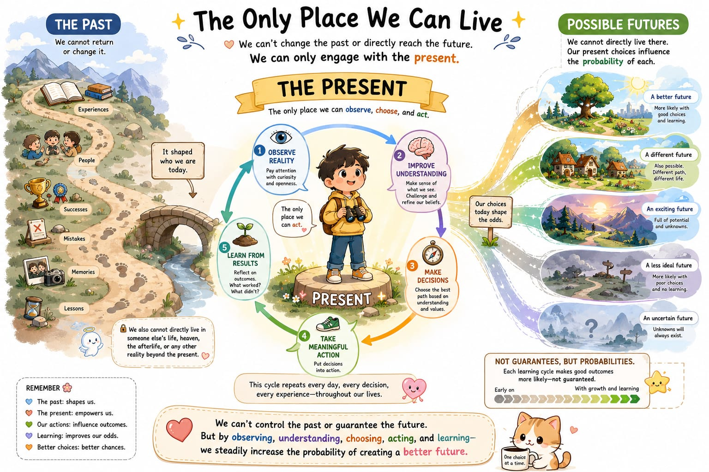
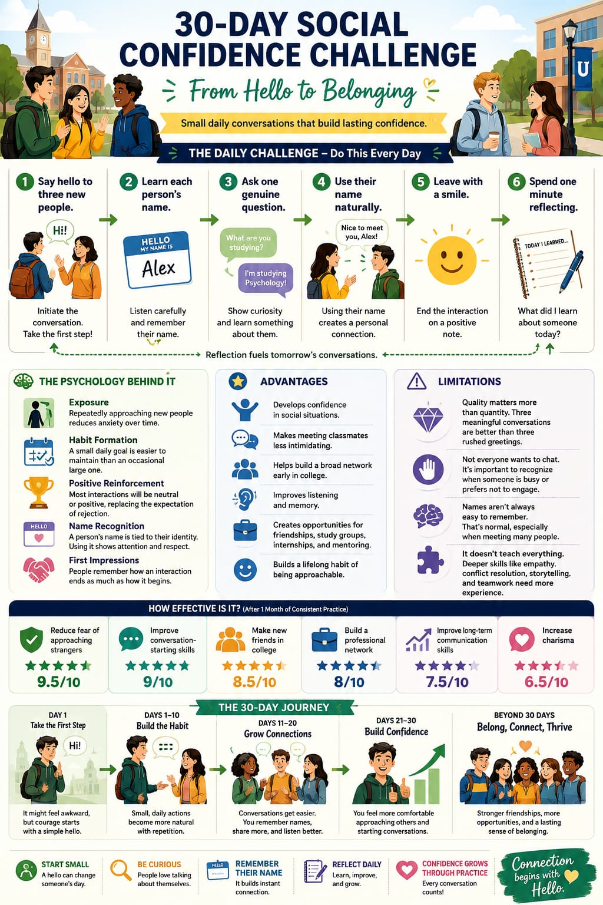

# VizSwitch — Visual Prompt Creator

**A personal project by B Hui that helps turn ideas, stories, processes, and system descriptions into structured visual prompts for infographics and illustrations.**

VizSwitch explores how custom GPT instructions can help people communicate visually: clarify the message and audience, suggest visual styles, and develop a detailed image-generation prompt while preserving the original meaning.

## Visual examples

These AI-generated examples were supplied by the creator as outputs produced with VizSwitch. They demonstrate narrative and educational uses beyond network or architecture diagrams. The original input prompts and generation transcripts are not included.

### The Only Place We Can Live

A narrative visual using a path, a learning cycle, and branching futures to explain a reflective idea about the present.

### 30-Day Social Confidence Challenge

An educational infographic combining daily steps, comparisons, and a timeline.

**Example note:** The numerical effectiveness scores and star ratings in this image are illustrative and unsupported by cited research. They are not measured results or validated predictions. This example demonstrates visual organization; its behavioral claims also need source review before educational reuse.

## How it works

1. Describe an idea or provide a reference image, audience, and intended message.
2. Review suggested visual styles and concept directions.
3. Select a direction, or ask VizSwitch to choose.
4. Review the structured prompt: layout, content, relationships, labels, style, and assumptions.
5. Confirm before image generation, then check the resulting visual.

The [reference instruction specification](INSTRUCTIONS.md) documents the architecture-oriented workflow that informed this project, including six style families, meaning-preservation rules, and a confirmation step. It is not a verified export of the live GPT configuration.

## Try an idea

Suggested starter requests, rather than the original prompts behind the examples:

- “Turn this idea into a narrative infographic for young readers: we can learn from the past, act in the present, and influence possible futures.”
- “Create a visual prompt for a 30-day conversation practice guide for college students. Avoid invented statistics or effectiveness scores.”
- “Explain this process visually for a nontechnical audience. Preserve the steps and relationships, and label any assumptions.”

Use the reference specification as a starting point for your own prompt workflow. Image generation requires an image-capable tool; output quality depends on the model and the input.

## About

B Hui designs instructions for custom GPTs and writes children's books as a hobby. VizSwitch is an evolving personal exploration of AI-assisted visual communication.

## Review and use

Check text, facts, labels, arrows, and relationships before sharing generated visuals. Metaphors express a message; they do not establish evidence. No formal performance evaluation is included in this showcase.

See [COPYRIGHT.md](COPYRIGHT.md) for use of the materials shared here.
