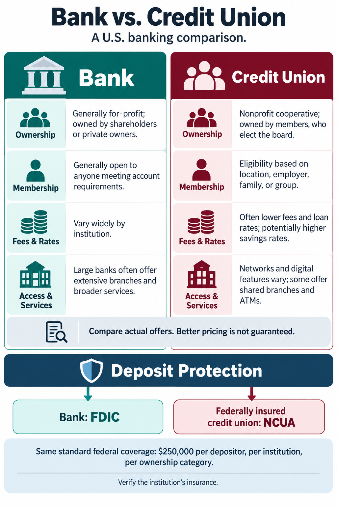

# Bank vs. Credit Union: Recorded Example

This educational comparison was produced in a Codex conversation using the installed VizSwitch plugin and Codex's built-in image generator. It demonstrates family 6, Narrative & Communication Visualization, rather than architecture visualization. The prompt and image below are retained from that conversation; this is not a separate live ChatGPT plugin session.

## 1. Input and source content

The user asked: **"What are the differences between a bank vs a credit union"** and then invoked **VizSwitch: Architecture-to-Image v1.1 "for above"**.

The preceding answer compared U.S. institutions across these categories:

| Category | Bank | Credit union |
| --- | --- | --- |
| Ownership | Generally for-profit; owners or shareholders | Nonprofit cooperative; member-owned |
| Membership | Generally anyone meeting account requirements | Eligibility through location, employer, family, or group |
| Fees and rates | Vary widely | Often lower fees and loan rates; potentially higher savings rates |
| Access and services | Large banks often have broader networks and services | Varies; some offer shared branches and ATMs |
| Federal deposit insurance | FDIC at insured banks | NCUA at federally insured credit unions |

The source answer explained that pricing advantages are not guaranteed and that standard federal deposit coverage is $250,000 per depositor, per institution, per ownership category. These are general comparisons, not advice about a named institution.

Factual sources used in the conversation:

- [NCUA: How is a credit union different than a bank?](https://mycreditunion.gov/about/what-credit-union/how-credit-union-different-bank)
- [FDIC: Deposit insurance FAQs](https://www.fdic.gov/resources/deposit-insurance/faq)
- [NCUA: Your insured funds](https://mycreditunion.gov/sites/default/static-files/insured-funds-brochure.pdf)

## 2. Style selection

VizSwitch recommended Narrative & Communication Visualization first, followed by Structural Representation and Behavior & Responsibility Modeling. It offered two concepts: Two Institutions, Same Everyday Needs; and Follow the Ownership.

The user replied **"choose for me"**. VizSwitch selected a side-by-side flat infographic in family 6. Below is the reviewed prompt, transcribed with Markdown headings instead of a block quote. Wording is preserved.

## 3. Reviewed image-generation prompt

Create a polished, readable infographic titled **"Bank vs. Credit Union"**, with the subtitle **"A U.S. banking comparison."**

**Layout:** Two equal columns, Bank on the left and Credit Union on the right. Use aligned rows for Ownership, Membership, Fees & Rates, and Access & Services. Place a shared Deposit Protection band beneath both columns.

**Content:**

- **Ownership:** Bank: "Generally for-profit; owned by shareholders or private owners." Credit Union: "Nonprofit cooperative; owned by members, who elect the board."
- **Membership:** Bank: "Generally open to anyone meeting account requirements." Credit Union: "Eligibility based on location, employer, family, or group."
- **Fees & Rates:** Bank: "Vary widely by institution." Credit Union: "Often lower fees and loan rates; potentially higher savings rates." Add a small shared note: "Compare actual offers. Better pricing is not guaranteed."
- **Access & Services:** Bank: "Large banks often offer extensive branches and broader services." Credit Union: "Networks and digital features vary; some offer shared branches and ATMs."
- **Deposit Protection:** Show two parallel labels: "Bank: FDIC" and "Federally insured credit union: NCUA." Beneath them: "Same standard federal coverage: $250,000 per depositor, per institution, per ownership category." Add: "Verify the institution's insurance."

**Relationships:** Connect each institution to its respective insurer using simple downward lines. Present protection as equivalent. Do not use numerical charts or imply measured differences in rates.

**Visual hierarchy:** Title first, institution names second, matching comparison rows third. Make deposit protection prominent and supporting caveats smaller but legible.

**Style:** Clean editorial infographic with simple icons, crisp lines, white background, charcoal text, teal for banks, and burgundy for credit unions. Use generous spacing and consistent typography. Avoid decorative clutter, tiny text, and exaggerated imagery.

**Do not change:** Preserve both institution types, all comparison categories, and the FDIC/NCUA distinction. Keep their insurance relationships separate. Do not imply that every credit union is federally insured or that credit unions always offer better rates.

**Assumptions:** General U.S. consumer audience; no specific institutions are being compared.

VizSwitch asked **"Should I generate the image now?"** The user confirmed **"generate"**.

## 4. Generator handoff and resulting image

The reviewed prompt was reformatted into the [exact generator input](generator-prompt.txt). That handoff adds a portrait format and explicit fit-without-overlap guidance; it retains the approved content and constraints. The image below is the original output, not a recreation.

## 5. Review and limitations

The rendered image contains all five comparison categories, the $250,000 standard coverage qualifier, the pricing caveat, and the instruction to verify insurance. It contains no invented effectiveness scores. One compositional difference is that the insurance arrows descend from a shared Deposit Protection band rather than directly from each institution; the labels remain aligned with the corresponding columns.

Text is best inspected by opening [the full-size image](comparison.png). General tendencies about rates and services vary by institution. Insurance eligibility and ownership categories require checking against the cited agencies. Image rendering is nondeterministic; the prompt does not guarantee an identical future image.
